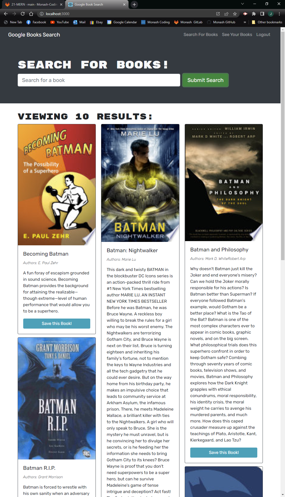

# W21-MERN-BOOKS
## Description
An updated starter code which gives function to search for books and save them for later viewing. Can log in and log out, search any books using the Google API as well as saving any in particular for later
## Installation
In order to be able to run the app from your own server, after being cloned you need to run, using node
```
npm install
```
Once node is installed, run the application you can use the following command
```
npm run start
```
## Screenshots of Application


## GitHub
If you want to vist my [GitHub](https://github.com/Jamlit37) or the [GitHub repository](https://github.com/Jamlit37/W21-MERN-BOOKS) click the links
